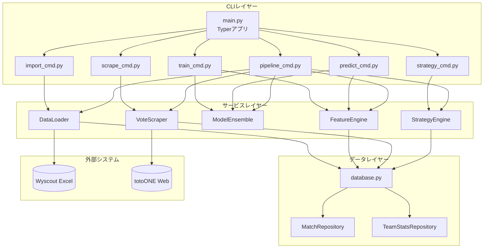
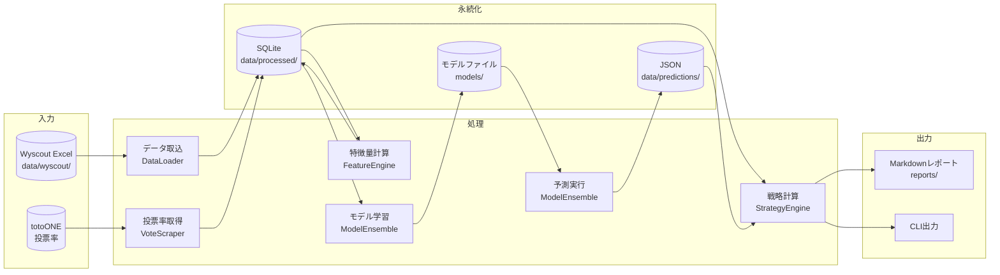
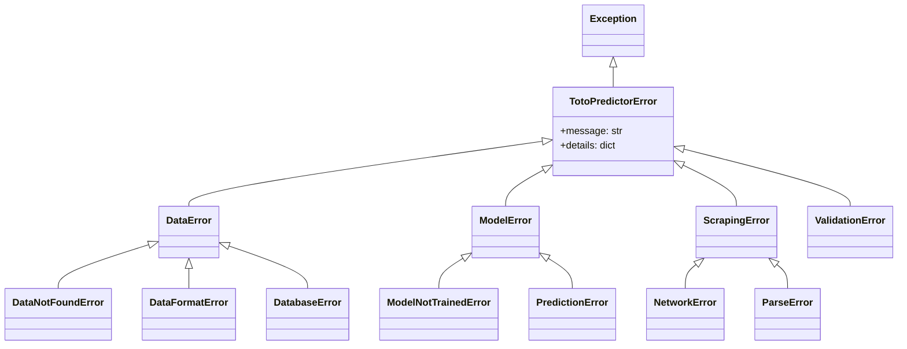

# 技術仕様書 (Architecture Design Document)

## テクノロジースタック

### 言語・ランタイム

| 技術 | バージョン |
|------|-----------|
| Python | 3.11+ |
| pip | 最新 |

### フレームワーク・ライブラリ

| 技術 | バージョン | 用途 | 選定理由 |
|------|-----------|------|----------|
| pandas | 2.x | データ処理 | 表形式データ処理のデファクトスタンダード |
| numpy | 1.26+ | 数値計算 | pandasの依存、高速な配列計算 |
| openpyxl | 3.x | Excel読み込み | pandas連携でxlsx形式対応 |
| scikit-learn | 1.4+ | 機械学習 | Poisson Regression、キャリブレーション |
| xgboost | 2.x | 勾配ブースティング | 高精度な分類・回帰モデル |
| scipy | 1.12+ | 統計計算 | ポアソン分布の確率計算 |
| requests | 2.31+ | HTTP通信 | スクレイピング用 |
| beautifulsoup4 | 4.12+ | HTML解析 | 投票率ページのパース |
| typer | 0.9+ | CLI | 型ヒント対応のモダンCLI |
| rich | 13.x | CLI出力 | テーブル表示、カラー出力 |
| joblib | 1.3+ | モデル保存 | scikit-learn互換の永続化 |

### 開発ツール

| 技術 | バージョン | 用途 | 選定理由 |
|------|-----------|------|----------|
| pytest | 8.x | テスト | Pythonテストのスタンダード |
| pytest-cov | 4.x | カバレッジ | テストカバレッジ計測 |
| ruff | 0.2+ | Linter/Formatter | 高速なPython Linter |
| mypy | 1.8+ | 型チェック | 静的型検査 |

## システム構成図

### コンポーネント図



### データフロー図



---

## アーキテクチャパターン

### レイヤードアーキテクチャ

```
┌─────────────────────────────────────────────────────┐
│   CLIレイヤー                                        │ ← ユーザー入力の受付と表示
│   (typer + rich)                                    │
├─────────────────────────────────────────────────────┤
│   サービスレイヤー                                    │ ← ビジネスロジック
│   (DataLoader, FeatureEngine, ModelEnsemble,        │
│    VoteScraper, StrategyEngine)                     │
├─────────────────────────────────────────────────────┤
│   データレイヤー                                      │ ← データ永続化
│   (SQLite, ファイルシステム)                          │
└─────────────────────────────────────────────────────┘
```

#### CLIレイヤー
- **責務**: コマンドライン引数のパース、バリデーション、結果の表示
- **許可される操作**: サービスレイヤーの呼び出し
- **禁止される操作**: データレイヤーへの直接アクセス、ビジネスロジックの実装

#### サービスレイヤー
- **責務**: データ処理、特徴量計算、モデル学習・推論、戦略計算
- **許可される操作**: データレイヤーの呼び出し、外部API（スクレイピング）
- **禁止される操作**: CLIレイヤーへの依存、直接的なユーザー入出力

#### データレイヤー
- **責務**: SQLiteへのCRUD操作、ファイル読み書き
- **許可される操作**: ファイルシステム、データベースへのアクセス
- **禁止される操作**: ビジネスロジックの実装

### ディレクトリ構造

```
toto-goal3-predictor/
├── src/
│   └── toto_predictor/
│       ├── __init__.py
│       ├── cli/                    # CLIレイヤー
│       │   ├── __init__.py
│       │   ├── main.py             # エントリーポイント
│       │   └── commands/
│       │       ├── import_cmd.py
│       │       ├── train_cmd.py
│       │       ├── predict_cmd.py
│       │       ├── scrape_cmd.py
│       │       ├── strategy_cmd.py
│       │       └── pipeline_cmd.py
│       ├── services/               # サービスレイヤー
│       │   ├── __init__.py
│       │   ├── data_loader.py
│       │   ├── feature_engine.py
│       │   ├── model_ensemble.py
│       │   ├── vote_scraper.py
│       │   └── strategy_engine.py
│       ├── models/                 # データモデル
│       │   ├── __init__.py
│       │   ├── match.py
│       │   ├── team_stats.py
│       │   ├── prediction.py
│       │   └── recommendation.py
│       └── db/                     # データレイヤー
│           ├── __init__.py
│           ├── database.py
│           └── migrations/
├── data/
│   ├── wyscout/
│   │   ├── 2024/
│   │   └── 2025/
│   ├── processed/
│   ├── predictions/
│   └── votes/
├── models/                         # 学習済みモデル
├── reports/                        # 出力レポート
├── tests/
│   ├── unit/
│   ├── integration/
│   └── fixtures/
├── pyproject.toml
└── README.md
```

## データ永続化戦略

### ストレージ方式

| データ種別 | ストレージ | フォーマット | 理由 |
|-----------|----------|-------------|------|
| 試合データ | SQLite | リレーショナル | 複雑なクエリ、トランザクション |
| チーム統計 | SQLite | リレーショナル | 試合データとのJOIN |
| 特徴量キャッシュ | SQLite | リレーショナル | 再計算回避 |
| 学習済みモデル | ファイル | joblib | scikit-learn標準 |
| 予測結果 | JSON | JSON | 可読性、バージョン管理 |
| 投票率 | JSON | JSON | スナップショット保存 |
| レポート | ファイル | Markdown | 可読性、共有容易 |

### SQLiteスキーマ

```sql
-- 試合テーブル
CREATE TABLE matches (
    id TEXT PRIMARY KEY,
    date DATE NOT NULL,
    season INTEGER NOT NULL,
    competition TEXT NOT NULL,
    home_team TEXT NOT NULL,
    away_team TEXT NOT NULL,
    home_goals INTEGER,
    away_goals INTEGER,
    duration INTEGER,
    created_at TIMESTAMP DEFAULT CURRENT_TIMESTAMP
);

-- チーム統計テーブル
CREATE TABLE team_stats (
    id TEXT PRIMARY KEY,
    match_id TEXT NOT NULL REFERENCES matches(id),
    team TEXT NOT NULL,
    is_home BOOLEAN NOT NULL,
    goals INTEGER,
    xg REAL,
    shots INTEGER,
    shots_on_target INTEGER,
    possession REAL,
    passes INTEGER,
    passes_accurate INTEGER,
    ppda REAL,
    -- ... その他の統計
    created_at TIMESTAMP DEFAULT CURRENT_TIMESTAMP
);

-- インデックス
CREATE INDEX idx_matches_date ON matches(date);
CREATE INDEX idx_matches_season ON matches(season);
CREATE INDEX idx_team_stats_team ON team_stats(team);
CREATE INDEX idx_team_stats_match ON team_stats(match_id);
```

### バックアップ戦略

- **頻度**: モデル学習完了時、週次パイプライン完了時
- **保存先**: `data/backups/` ディレクトリ
- **世代管理**: 最新5世代を保持
- **対象**: SQLiteファイル、学習済みモデル
- **復元方法**: バックアップファイルを元の場所にコピー

## パフォーマンス要件

### レスポンスタイム

| 操作 | 目標時間 | 測定環境 |
|------|---------|---------|
| データインポート（1ファイル） | 5秒以内 | 標準PC |
| 特徴量計算（1チーム） | 3秒以内 | 標準PC |
| モデル推論（6チーム） | 10秒以内 | 標準PC |
| 投票率スクレイピング | 30秒以内 | 標準ネットワーク |
| パイプライン全体 | 2分以内 | 標準PC |

### リソース使用量

| リソース | 上限 | 理由 |
|---------|------|------|
| メモリ | 2GB | 中規模データセットの処理 |
| ディスク | 500MB | データ + モデル + レポート |

## セキュリティアーキテクチャ

### データ保護

- **暗号化**: 不要（個人情報を扱わない）
- **アクセス制御**: OSレベルのファイルパーミッション
- **機密情報管理**: なし（APIキー等不要）

### 入力検証

- **Excelファイル**: ファイル形式、必須カラムの存在確認
- **CLI引数**: Typerによる型検証
- **スクレイピング結果**: 投票率の合計が100%前後か確認

### スクレイピング倫理

- **robots.txt**: 遵守
- **リクエスト間隔**: 1秒以上
- **User-Agent**: 適切なUA文字列を設定
- **エラー時**: 即座に中断、再試行は手動

---

## エラーハンドリングアーキテクチャ

### 例外階層



### 例外クラス定義

```python
# src/toto_predictor/models/exceptions.py

class TotoPredictorError(Exception):
    """基底例外クラス"""
    def __init__(self, message: str, details: dict | None = None):
        self.message = message
        self.details = details or {}
        super().__init__(self.message)

class DataError(TotoPredictorError):
    """データ関連エラーの基底クラス"""
    pass

class DataNotFoundError(DataError):
    """データが見つからない場合"""
    pass

class DataFormatError(DataError):
    """データ形式が不正な場合"""
    pass

class DatabaseError(DataError):
    """データベース操作エラー"""
    pass

class ModelError(TotoPredictorError):
    """モデル関連エラーの基底クラス"""
    pass

class ModelNotTrainedError(ModelError):
    """モデルが学習されていない場合"""
    pass

class ScrapingError(TotoPredictorError):
    """スクレイピング関連エラーの基底クラス"""
    pass

class ValidationError(TotoPredictorError):
    """入力検証エラー"""
    def __init__(self, field: str, value: any, message: str):
        super().__init__(message, {"field": field, "value": value})
```

### レイヤー別エラー処理方針

| レイヤー | 処理方針 | ユーザー通知 |
|---------|---------|-------------|
| CLI | 全例外をキャッチし、ユーザーフレンドリーなメッセージを表示 | Rich consoleで色付き表示 |
| Service | ビジネスロジックエラーを適切な例外に変換 | ログ出力（DEBUG/INFO/WARNING） |
| Data | DB/ファイルエラーをDataErrorでラップ | ログ出力（ERROR） |

### リトライポリシー

| 操作 | 最大リトライ | 待機戦略 | タイムアウト |
|------|------------|---------|-------------|
| スクレイピング | 3回 | 指数バックオフ (1s, 2s, 4s) | 30秒 |
| DB接続 | 3回 | 固定間隔 (1s) | 5秒 |
| ファイル読み込み | 1回 | なし | 60秒 |

### CLIでのエラー表示例

```python
# cli/main.py
from rich.console import Console

console = Console()

def handle_error(e: TotoPredictorError) -> None:
    console.print(f"[red]エラー[/red]: {e.message}")
    if e.details:
        console.print(f"[dim]詳細: {e.details}[/dim]")

    # エラー種別に応じたヒントを表示
    if isinstance(e, DataNotFoundError):
        console.print("[yellow]ヒント[/yellow]: 'toto-predictor import' でデータを取り込んでください")
    elif isinstance(e, ModelNotTrainedError):
        console.print("[yellow]ヒント[/yellow]: 'toto-predictor train' でモデルを学習してください")
    elif isinstance(e, ScrapingError):
        console.print("[yellow]ヒント[/yellow]: ネットワーク接続を確認し、しばらく待ってから再試行してください")
```

---

## コンポーネント間インターフェース

### DataLoader インターフェース

```python
from typing import Protocol
from datetime import datetime
from .models import Match, TeamStats

class IDataLoader(Protocol):
    def load_excel(self, file_path: str, season: int) -> int:
        """Excelファイルを読み込み、DBに保存。追加件数を返す"""
        ...

    def load_directory(self, dir_path: str, season: int) -> int:
        """ディレクトリ内の全Excelを読み込み"""
        ...

    def get_team_matches(
        self, team: str, limit: int | None = None
    ) -> list[Match]:
        """チームの試合データを取得"""
        ...

    def get_team_stats(
        self, team: str, start_date: datetime | None = None
    ) -> list[TeamStats]:
        """チームの統計データを取得"""
        ...

    def get_teams(self) -> list[str]:
        """登録済みチーム一覧を取得"""
        ...
```

### FeatureEngine インターフェース

```python
class IFeatureEngine(Protocol):
    def calculate_features(
        self,
        team: str,
        as_of_date: datetime,
        window_sizes: list[int] = [5, 10, 20]
    ) -> TeamFeatures:
        """指定チームの特徴量を計算"""
        ...

    def prepare_training_data(
        self, seasons: list[int]
    ) -> tuple[pd.DataFrame, pd.Series]:
        """学習用データ（X, y）を準備"""
        ...
```

### ModelEnsemble インターフェース

```python
class IModelEnsemble(Protocol):
    def train(
        self,
        X: pd.DataFrame,
        y: pd.Series,
        cv_folds: int = 5
    ) -> dict:
        """モデルを学習し、検証結果を返す"""
        ...

    def predict(self, features: pd.DataFrame) -> Prediction:
        """予測を実行"""
        ...

    def save(self, model_dir: str) -> None:
        """モデルを保存"""
        ...

    def load(self, model_dir: str) -> None:
        """モデルを読み込み"""
        ...
```

### VoteScraper インターフェース

```python
class IVoteScraper(Protocol):
    def fetch(self, round_number: int | None = None) -> list[VoteRate]:
        """投票率を取得"""
        ...

    def get_cached(self, round_number: int) -> list[VoteRate] | None:
        """キャッシュから投票率を取得"""
        ...
```

### StrategyEngine インターフェース

```python
class IStrategyEngine(Protocol):
    def calculate_value_scores(
        self,
        predictions: list[Prediction],
        vote_rates: list[VoteRate]
    ) -> list[Recommendation]:
        """バリュースコアを計算し、推奨を生成"""
        ...

    def generate_report(
        self,
        recommendations: list[Recommendation],
        output_path: str
    ) -> None:
        """Markdownレポートを生成"""
        ...
```

---

## スケーラビリティ設計

### データ増加への対応

- **想定データ量**: 5シーズン分（約2,500試合）
- **パフォーマンス劣化対策**:
  - SQLiteインデックス
  - 特徴量キャッシュ
  - 必要な期間のデータのみロード
- **アーカイブ戦略**: 3シーズン以上前のデータはアーカイブ可能

### 機能拡張性

- **リーグ追加**: データモデルはリーグに依存しない設計
- **モデル追加**: ModelEnsembleに新モデルを追加可能
- **出力形式追加**: StrategyEngineにフォーマッターを追加可能

## テスト戦略

### ユニットテスト
- **フレームワーク**: pytest
- **対象**:
  - 特徴量計算ロジック
  - バリュースコア計算
  - 購入判断ロジック
- **カバレッジ目標**: 80%

### 統合テスト
- **方法**: サンプルデータを使用した結合テスト
- **対象**:
  - データインポート〜特徴量計算
  - 予測〜戦略計算〜レポート生成

### E2Eテスト
- **ツール**: pytest + subprocess
- **シナリオ**:
  - パイプライン全体の実行
  - 各CLIコマンドの実行

### テストデータ
- **場所**: `tests/fixtures/`
- **内容**:
  - サンプルExcelファイル（10試合分）
  - モックHTML（totoONE）
  - 期待される出力

## 技術的制約

### 環境要件
- **OS**: Linux, macOS, Windows
- **Python**: 3.11以上
- **最小メモリ**: 4GB
- **必要ディスク容量**: 1GB
- **ネットワーク**: 投票率取得時のみ必要

### 外部依存
- **totoONE**: サイト構造変更時はスクレイパー修正が必要
- **Wyscout**: Excel形式の変更時はパーサー修正が必要

### パフォーマンス制約
- XGBoostの学習は大量データでは時間がかかる（数分〜）
- SQLiteは同時書き込みに弱い（単一プロセス前提）

## 依存関係管理

| ライブラリ | 用途 | バージョン管理方針 |
|-----------|------|-------------------|
| pandas | データ処理 | メジャーバージョン固定 (2.x) |
| xgboost | モデル | メジャーバージョン固定 (2.x) |
| scikit-learn | ML基盤 | メジャーバージョン固定 (1.x) |
| typer | CLI | マイナーバージョン固定 (0.9.x) |
| requests | HTTP | メジャーバージョン固定 (2.x) |
| beautifulsoup4 | HTML解析 | メジャーバージョン固定 (4.x) |

### 依存関係の更新方針

- セキュリティアップデート: 即座に適用
- マイナーアップデート: 月次で検討
- メジャーアップデート: 互換性確認後に適用

## 開発環境セットアップ

```bash
# リポジトリをクローン
git clone <repository-url>
cd toto-goal3-predictor

# 仮想環境を作成
python -m venv .venv
source .venv/bin/activate  # Windows: .venv\Scripts\activate

# 依存関係をインストール
pip install -e ".[dev]"

# テスト実行
pytest

# Linter/Formatter実行
ruff check .
ruff format .
```
