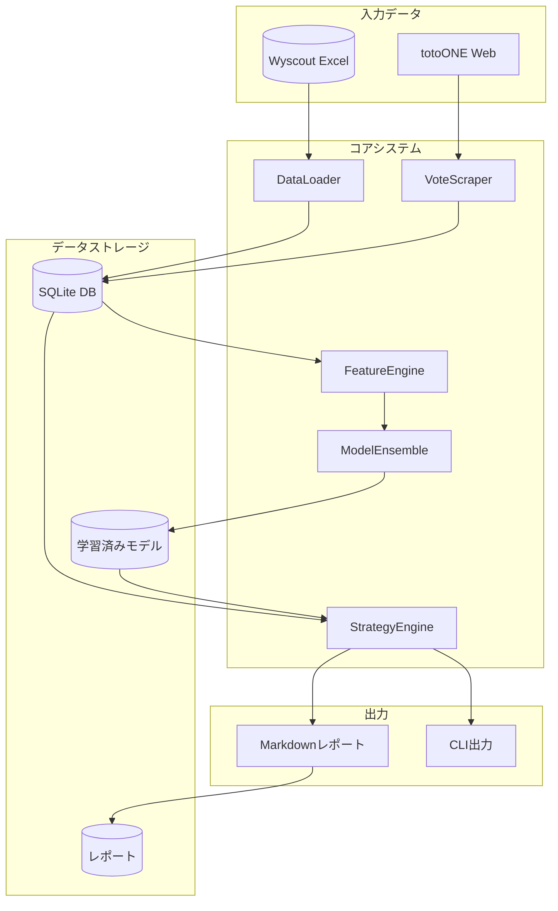
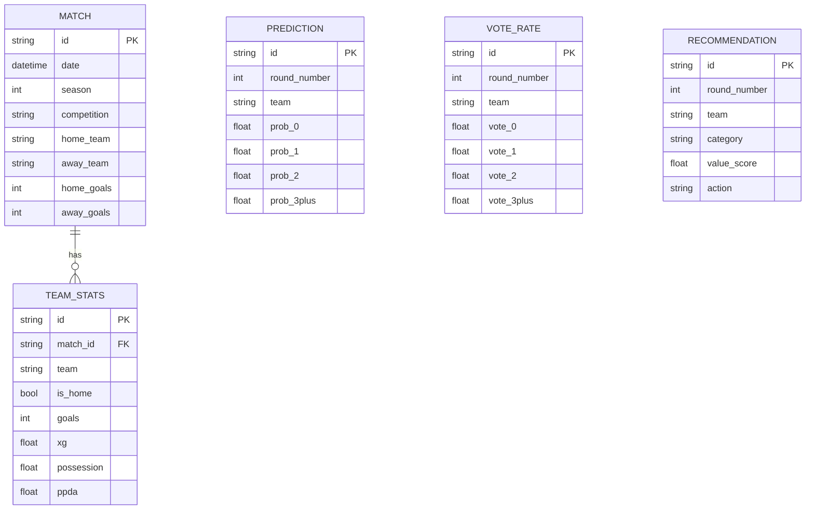
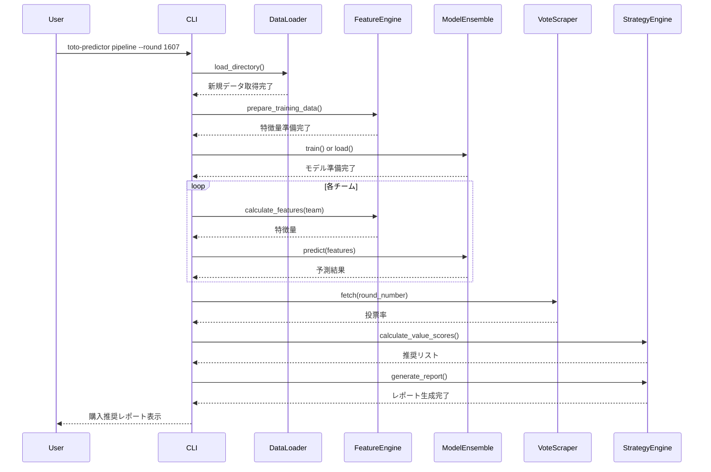
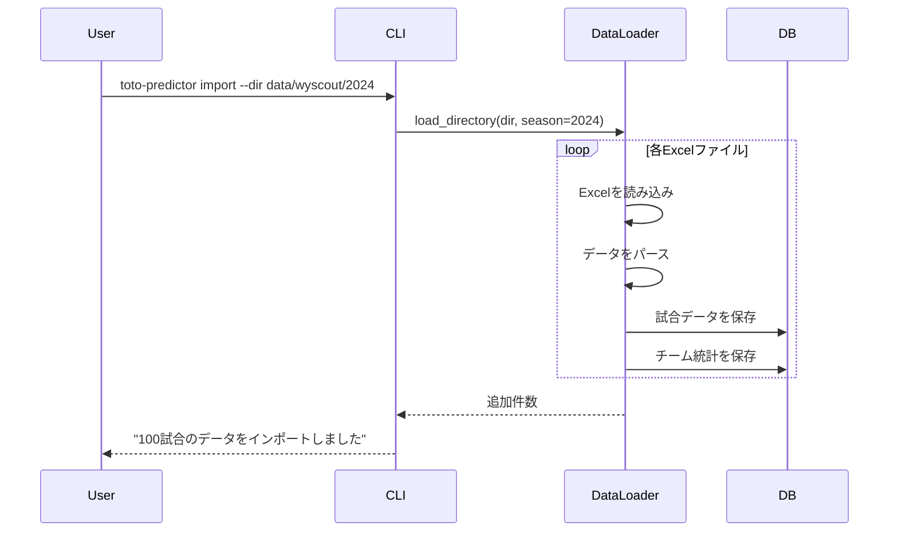

# 機能設計書 (Functional Design Document)

## システム構成図



## 技術スタック

| 分類 | 技術 | 選定理由 |
|------|------|----------|
| 言語 | Python 3.11+ | データサイエンス系ライブラリの充実 |
| データ処理 | pandas, numpy | 表形式データ処理のデファクトスタンダード |
| Excel読み込み | openpyxl | pandas連携でxlsx読み込み |
| 機械学習 | scikit-learn, XGBoost | 高速・高精度な勾配ブースティング |
| スクレイピング | requests, BeautifulSoup4 | 軽量で柔軟なHTML解析 |
| データベース | SQLite | ファイルベースで運用シンプル |
| CLI | Typer | 型ヒント対応のモダンCLIフレームワーク |
| テスト | pytest | Pythonテストのデファクトスタンダード |

## データモデル定義

### エンティティ: Match（試合データ）

```python
@dataclass
class Match:
    id: str                    # UUID
    date: datetime             # 試合日
    season: int                # シーズン年（2024, 2025等）
    competition: str           # 大会名（Japan. J1 League等）
    home_team: str             # ホームチーム名
    away_team: str             # アウェイチーム名
    home_goals: int            # ホームチーム得点
    away_goals: int            # アウェイチーム得点
    duration: int              # 試合時間（分）
    created_at: datetime       # レコード作成日時
```

### エンティティ: TeamStats（チーム統計）

```python
@dataclass
class TeamStats:
    id: str                    # UUID
    match_id: str              # 試合ID（FK）
    team: str                  # チーム名
    is_home: bool              # ホームかどうか

    # 攻撃指標
    goals: int                 # 得点
    xg: float                  # 期待得点
    shots: int                 # シュート数
    shots_on_target: int       # 枠内シュート

    # チャンス創出
    possession: float          # ボール支配率（%）
    passes: int                # パス数
    passes_accurate: int       # 成功パス数
    crosses: int               # クロス数
    crosses_accurate: int      # 成功クロス数
    pen_area_entries: int      # ペナルティエリア侵入回数

    # 守備指標
    conceded_goals: int        # 失点
    shots_against: int         # 被シュート数
    shots_against_on_target: int  # 被枠内シュート
    ppda: float                # PPDA（プレス強度）
    interceptions: int         # インターセプト数

    # その他
    fouls: int                 # ファウル数
    yellow_cards: int          # イエローカード
    red_cards: int             # レッドカード
```

### エンティティ: TeamFeatures（特徴量）

```python
@dataclass
class TeamFeatures:
    team: str                  # チーム名
    calculated_at: datetime    # 計算日時
    window_size: int           # 計算に使用した試合数

    # 基本統計（平均）
    goals_mean: float
    goals_std: float
    xg_mean: float
    xg_std: float
    xg_trend: float            # 直近5試合 - 直近20試合
    shots_on_target_mean: float
    possession_mean: float

    # 守備統計
    conceded_mean: float
    conceded_std: float
    xga_mean: float            # 被xG平均
    ppda_mean: float

    # 派生特徴量
    shot_conversion: float     # goals / shots
    xg_overperformance: float  # goals - xG
    counter_ratio: float       # カウンター比率
```

### エンティティ: Prediction（予測結果）

```python
@dataclass
class Prediction:
    id: str                    # UUID
    round_number: int          # toto回号
    team: str                  # チーム名
    predicted_at: datetime     # 予測日時

    # 得点確率分布
    prob_0: float              # 0点の確率
    prob_1: float              # 1点の確率
    prob_2: float              # 2点の確率
    prob_3plus: float          # 3点以上の確率

    # モデル別予測（参考）
    poisson_lambda: float      # ポアソンのλ
    xgb_probs: list[float]     # XGBoostの生確率
```

### エンティティ: VoteRate（投票率）

```python
@dataclass
class VoteRate:
    id: str                    # UUID
    round_number: int          # toto回号
    team: str                  # チーム名
    fetched_at: datetime       # 取得日時

    # 投票率
    vote_0: float              # 0点の投票率
    vote_1: float              # 1点の投票率
    vote_2: float              # 2点の投票率
    vote_3plus: float          # 3点以上の投票率
```

### エンティティ: Recommendation（購入推奨）

```python
@dataclass
class Recommendation:
    id: str                    # UUID
    round_number: int          # toto回号
    team: str                  # チーム名
    category: str              # "0", "1", "2", "3+"

    # スコア
    model_prob: float          # モデル予測確率
    vote_rate: float           # 公衆投票率
    value_score: float         # バリュースコア

    # 推奨
    action: str                # "必買", "買い", "検討", "スキップ"
    kelly_fraction: float      # ケリー基準による推奨比率
    confidence: str            # "high", "medium", "low"
```

### データモデルバリデーション仕様

#### Match バリデーション

| フィールド | ルール | エラーメッセージ |
|-----------|-------|-----------------|
| date | 未来日付不可 | "試合日は未来の日付にできません" |
| season | 2020-2030の範囲 | "シーズンは2020-2030の範囲で指定してください" |
| home_goals | 0以上の整数 | "得点は0以上の整数で指定してください" |
| away_goals | 0以上の整数 | "得点は0以上の整数で指定してください" |
| home_team | 空文字不可 | "ホームチーム名は必須です" |
| away_team | 空文字不可 | "アウェイチーム名は必須です" |

```python
@dataclass
class Match:
    # ... フィールド定義 ...

    def __post_init__(self):
        if self.date > datetime.now():
            raise ValidationError("date", self.date, "試合日は未来の日付にできません")
        if not (2020 <= self.season <= 2030):
            raise ValidationError("season", self.season, "シーズンは2020-2030の範囲で指定してください")
        if self.home_goals is not None and self.home_goals < 0:
            raise ValidationError("home_goals", self.home_goals, "得点は0以上の整数で指定してください")
        if not self.home_team or not self.home_team.strip():
            raise ValidationError("home_team", self.home_team, "ホームチーム名は必須です")
```

#### TeamStats バリデーション

| フィールド | ルール | エラーメッセージ |
|-----------|-------|-----------------|
| goals | >= 0 | "得点は0以上で指定してください" |
| xg | >= 0.0 | "xGは0以上で指定してください" |
| possession | 0.0 - 100.0 | "ボール支配率は0-100%の範囲で指定してください" |
| shots_on_target | <= shots | "枠内シュート数はシュート数を超えられません" |
| ppda | > 0.0 | "PPDAは正の値で指定してください" |

```python
@dataclass
class TeamStats:
    # ... フィールド定義 ...

    def __post_init__(self):
        if self.goals < 0:
            raise ValidationError("goals", self.goals, "得点は0以上で指定してください")
        if self.xg < 0:
            raise ValidationError("xg", self.xg, "xGは0以上で指定してください")
        if not (0 <= self.possession <= 100):
            raise ValidationError("possession", self.possession, "ボール支配率は0-100%の範囲で指定してください")
        if self.shots_on_target > self.shots:
            raise ValidationError("shots_on_target", self.shots_on_target, "枠内シュート数はシュート数を超えられません")
```

#### VoteRate バリデーション

| フィールド | ルール | エラーメッセージ |
|-----------|-------|-----------------|
| vote_0〜vote_3plus | 0.0-1.0の範囲 | "投票率は0-100%の範囲で指定してください" |
| 合計 | 0.95-1.05の範囲（誤差許容） | "投票率の合計が100%になっていません" |

```python
@dataclass
class VoteRate:
    # ... フィールド定義 ...

    def validate(self) -> None:
        """データバリデーション"""
        rates = [self.vote_0, self.vote_1, self.vote_2, self.vote_3plus]

        # 各投票率の範囲チェック
        for i, rate in enumerate(rates):
            if not (0.0 <= rate <= 1.0):
                raise ValidationError(f"vote_{i}", rate, "投票率は0-100%の範囲で指定してください")

        # 合計チェック
        total = sum(rates)
        if not (0.95 <= total <= 1.05):
            raise ValidationError("vote_total", total, f"投票率の合計が100%になっていません: {total*100:.1f}%")
```

#### Prediction バリデーション

| フィールド | ルール | エラーメッセージ |
|-----------|-------|-----------------|
| prob_0〜prob_3plus | 0.0-1.0の範囲 | "確率は0-100%の範囲で指定してください" |
| 合計 | 0.99-1.01の範囲 | "予測確率の合計が100%になっていません" |

---

### ER図



## コンポーネント設計

### DataLoader

**責務**:
- Wyscout Excelファイルの読み込み
- データの正規化・クレンジング
- SQLiteへの保存

```python
class DataLoader:
    def __init__(self, db_path: str):
        """データベース接続を初期化"""
        pass

    def load_excel(self, file_path: str, season: int) -> int:
        """Excelファイルを読み込み、DBに保存

        Returns:
            追加された試合数
        """
        pass

    def load_directory(self, dir_path: str, season: int) -> int:
        """ディレクトリ内の全Excelを読み込み"""
        pass

    def get_team_matches(self, team: str, limit: int = None) -> list[Match]:
        """チームの試合一覧を取得"""
        pass
```

**依存関係**:
- pandas, openpyxl（Excel読み込み）
- sqlite3（DB操作）

### FeatureEngine

**責務**:
- 生データからの特徴量生成
- ウィンドウ統計の計算
- 派生特徴量の計算

```python
class FeatureEngine:
    def __init__(self, db_path: str):
        """データベース接続を初期化"""
        pass

    def calculate_features(
        self,
        team: str,
        as_of_date: datetime,
        window_sizes: list[int] = [5, 10, 20]
    ) -> TeamFeatures:
        """指定日時点での特徴量を計算"""
        pass

    def calculate_opponent_features(
        self,
        team: str,
        opponent: str,
        as_of_date: datetime
    ) -> dict:
        """対戦相手の特徴量を計算"""
        pass

    def prepare_training_data(
        self,
        seasons: list[int]
    ) -> tuple[pd.DataFrame, pd.Series]:
        """モデル学習用データを準備

        Returns:
            (特徴量DataFrame, 目的変数Series)
        """
        pass
```

**依存関係**:
- DataLoader（データ取得）
- pandas, numpy（計算）

### ModelEnsemble

**責務**:
- 複数モデルの学習
- アンサンブル予測
- モデルの保存・読み込み

```python
class ModelEnsemble:
    def __init__(self, model_dir: str):
        """モデル保存ディレクトリを設定"""
        pass

    def train(
        self,
        X: pd.DataFrame,
        y: pd.Series,
        cv_folds: int = 5
    ) -> dict:
        """モデルを学習

        Returns:
            検証結果（Brier Score等）
        """
        pass

    def predict(self, features: TeamFeatures) -> Prediction:
        """得点分布を予測"""
        pass

    def save(self) -> None:
        """モデルをファイルに保存"""
        pass

    def load(self) -> None:
        """保存済みモデルを読み込み"""
        pass
```

**依存関係**:
- scikit-learn（Poisson Regression, Calibration）
- XGBoost（メインモデル）
- joblib（モデル保存）

### VoteScraper

**責務**:
- totoONEからの投票率取得
- HTML解析
- リトライ処理

```python
class VoteScraper:
    BASE_URL = "https://www.totoone.jp/prediction"

    def __init__(self, db_path: str):
        """データベース接続を初期化"""
        pass

    def fetch(self, round_number: int = None) -> list[VoteRate]:
        """投票率を取得

        Args:
            round_number: 指定なしの場合は最新回

        Returns:
            6チーム分の投票率
        """
        pass

    def _parse_html(self, html: str) -> list[dict]:
        """HTMLから投票率を抽出"""
        pass

    def _retry_fetch(self, url: str, max_retries: int = 3) -> str:
        """リトライ付きHTTP取得"""
        pass
```

**依存関係**:
- requests（HTTP通信）
- BeautifulSoup4（HTML解析）

### StrategyEngine

**責務**:
- バリュースコア計算
- 購入推奨生成
- レポート出力

```python
class StrategyEngine:
    def __init__(self, db_path: str):
        """データベース接続を初期化"""
        pass

    def calculate_value_scores(
        self,
        predictions: list[Prediction],
        vote_rates: list[VoteRate]
    ) -> list[Recommendation]:
        """バリュースコアを計算し推奨を生成"""
        pass

    def generate_report(
        self,
        recommendations: list[Recommendation],
        output_path: str
    ) -> None:
        """Markdownレポートを生成"""
        pass

    def _calculate_kelly(
        self,
        prob: float,
        vote_rate: float,
        fraction: float = 0.25
    ) -> float:
        """ケリー基準でベットサイズを計算"""
        pass
```

**依存関係**:
- ModelEnsemble（予測取得）
- VoteScraper（投票率取得）

## ユースケース図

### ユースケース1: 週次パイプライン実行



### ユースケース2: データインポート



## アルゴリズム設計

### アルゴリズム1: 得点分布予測

**目的**: チームの得点確率分布（0点, 1点, 2点, 3点以上）を予測

#### ステップ1: Poisson Regressionによるλ予測

ポアソン分布のパラメータλ（期待得点）を予測:

```python
from sklearn.linear_model import PoissonRegressor

def train_poisson_model(X: pd.DataFrame, y: pd.Series) -> PoissonRegressor:
    model = PoissonRegressor(alpha=0.1, max_iter=1000)
    model.fit(X, y)
    return model

def poisson_to_probs(lambda_: float) -> dict:
    """λからtotoカテゴリ確率を計算"""
    from scipy.stats import poisson

    p_0 = poisson.pmf(0, lambda_)
    p_1 = poisson.pmf(1, lambda_)
    p_2 = poisson.pmf(2, lambda_)
    p_3plus = 1 - p_0 - p_1 - p_2

    return {'0': p_0, '1': p_1, '2': p_2, '3+': p_3plus}
```

#### ステップ2: XGBoostによる分類予測

得点数（0-5+）を直接分類:

```python
import xgboost as xgb

def train_xgboost_model(X: pd.DataFrame, y: pd.Series) -> xgb.XGBClassifier:
    # 得点を0-5にクリップ（5以上は5として扱う）
    y_clipped = y.clip(upper=5)

    model = xgb.XGBClassifier(
        objective='multi:softprob',
        num_class=6,
        max_depth=6,
        learning_rate=0.05,
        n_estimators=500,
        subsample=0.8,
        colsample_bytree=0.8,
        reg_alpha=0.1,
        reg_lambda=1.0,
        random_state=42
    )
    model.fit(X, y_clipped)
    return model

def xgb_to_toto_probs(probs: np.ndarray) -> dict:
    """XGBoost出力をtotoカテゴリに変換"""
    return {
        '0': probs[0],
        '1': probs[1],
        '2': probs[2],
        '3+': probs[3:].sum()
    }
```

#### ステップ3: アンサンブル

重み付き平均でモデルを統合:

```python
def ensemble_predict(
    poisson_probs: dict,
    xgb_probs: dict,
    weights: dict = {'poisson': 0.3, 'xgboost': 0.7}
) -> dict:
    """アンサンブル予測"""
    final = {}
    for cat in ['0', '1', '2', '3+']:
        final[cat] = (
            weights['poisson'] * poisson_probs[cat] +
            weights['xgboost'] * xgb_probs[cat]
        )
    return final
```

#### ステップ4: キャリブレーション

予測確率を実際の発生確率に近づける:

```python
from sklearn.calibration import CalibratedClassifierCV

def calibrate_model(model, X: pd.DataFrame, y: pd.Series) -> CalibratedClassifierCV:
    calibrated = CalibratedClassifierCV(
        estimator=model,
        method='isotonic',
        cv=5
    )
    calibrated.fit(X, y)
    return calibrated
```

### アルゴリズム2: バリュースコア計算

**目的**: モデル予測と公衆投票率のギャップからバリューベットを特定

#### 計算式

```python
def calculate_value_score(model_prob: float, vote_rate: float) -> float:
    """バリュースコア = モデル確率 / 投票率"""
    MIN_RATE = 0.01  # ゼロ除算防止
    return model_prob / max(vote_rate, MIN_RATE)
```

#### 購入判断マトリクス

```python
def determine_action(model_prob: float, value_score: float) -> str:
    """購入アクションを決定"""
    if model_prob >= 0.30:
        if value_score >= 1.5:
            return "必買"
        elif value_score >= 1.0:
            return "買い"
        else:
            return "慎重"
    elif model_prob >= 0.15:
        if value_score >= 1.5:
            return "買い"
        elif value_score >= 1.0:
            return "検討"
        else:
            return "スキップ"
    else:
        if value_score >= 1.5:
            return "検討"
        else:
            return "スキップ"
```

### アルゴリズム3: Kelly Criterion

**目的**: 最適なベットサイズを計算

```python
def calculate_kelly_fraction(
    p_win: float,
    vote_rate: float,
    kelly_fraction: float = 0.25
) -> float:
    """
    ケリー基準でベットサイズを計算

    Args:
        p_win: モデルによる勝率予測
        vote_rate: 公衆投票率（≒オッズの逆数）
        kelly_fraction: フルケリーの何倍を使うか（デフォルト1/4）

    Returns:
        推奨ベット比率（0-1）
    """
    # 簡易オッズ推定（パリミュチュエル方式）
    estimated_odds = 1.0 / vote_rate if vote_rate > 0 else 1.0

    # エッジ（期待値）
    edge = p_win * estimated_odds - 1

    if edge <= 0:
        return 0.0

    # フルケリー
    full_kelly = edge / (estimated_odds - 1) if estimated_odds > 1 else 0

    # 分数ケリー（リスク軽減）
    return min(full_kelly * kelly_fraction, 0.1)  # 最大10%
```

## ファイル構造

```
data/
├── wyscout/
│   ├── 2024/                    # 2024シーズンデータ
│   │   └── Team Stats *.xlsx
│   └── 2025/                    # 2025シーズンデータ
│       └── Team Stats *.xlsx
├── processed/
│   └── features.db              # SQLiteデータベース
├── predictions/
│   └── round_1607.json          # 予測結果
└── votes/
    └── round_1607.json          # 投票率データ

models/
├── poisson_model.joblib         # Poissonモデル
├── xgb_model.joblib             # XGBoostモデル
└── calibrator.joblib            # キャリブレーター

reports/
└── round_1607_strategy.md       # 購入推奨レポート
```

## CLI設計

### コマンド一覧

```bash
# データインポート
toto-predictor import --dir <path> --season <year>
  # 例: toto-predictor import --dir data/wyscout/2024 --season 2024

# 特徴量確認
toto-predictor features --team <name> --window <n>
  # 例: toto-predictor features --team "Yokohama F. Marinos" --window 10

# モデル学習
toto-predictor train --cv <folds>
  # 例: toto-predictor train --cv 5

# 予測実行
toto-predictor predict --round <number> --teams <team1,team2,...>
  # 例: toto-predictor predict --round 1607 --teams "Yokohama F. Marinos,Kawasaki Frontale"

# 投票率取得
toto-predictor scrape --round <number>
  # 例: toto-predictor scrape --round 1607

# 戦略実行（予測+投票率+推奨）
toto-predictor strategy --round <number> --output <path>
  # 例: toto-predictor strategy --round 1607 --output reports/

# パイプライン全体実行
toto-predictor pipeline --round <number>
  # 例: toto-predictor pipeline --round 1607
```

### 出力フォーマット仕様

#### import コマンド出力

```
$ toto-predictor import --dir data/wyscout/2024 --season 2024

データインポート開始...
├── Team Stats Yokohama F. Marinos.xlsx ... ✓ 38試合
├── Team Stats Kawasaki Frontale.xlsx ... ✓ 38試合
├── Team Stats Kashima Antlers.xlsx ... ✓ 38試合
├── Team Stats Invalid File.xlsx ... ✗ スキップ（必須カラム欠落）
└── 完了

================================================================================
インポート結果
================================================================================
対象ファイル数:     20
成功:              19
スキップ:           1
エラー:             0
取り込み試合数:    380
--------------------------------------------------------------------------------
```

#### train コマンド出力

```
$ toto-predictor train --cv 5

モデル学習開始...

[1/3] Poisson Regression
      学習中... ━━━━━━━━━━━━━━━━━━━━ 100%
      CV Brier Score: 0.187 (±0.012)

[2/3] XGBoost Classifier
      学習中... ━━━━━━━━━━━━━━━━━━━━ 100%
      CV Brier Score: 0.172 (±0.015)

[3/3] Ensemble + Calibration
      キャリブレーション中... ━━━━━━━━━━━━━━━━━━━━ 100%
      CV Brier Score: 0.168 (±0.011)

================================================================================
学習結果
================================================================================
最終モデル:         Ensemble (Poisson 30% + XGBoost 70%)
Brier Score:       0.168 ✓ (目標: < 0.20)
カテゴリ的中率:     42.3% ✓ (目標: > 40%)
保存先:            models/
--------------------------------------------------------------------------------
```

#### predict コマンド出力

```
$ toto-predictor predict --round 1607 --teams "横浜FM,川崎,鹿島"

第1607回 GOAL3 予測結果
================================================================================

[1/3] 横浜F・マリノス
┌────────────┬──────────┬──────────┐
│ カテゴリ    │ 予測確率  │ 信頼度    │
├────────────┼──────────┼──────────┤
│ 0点        │   18.2%  │ ████░░   │
│ 1点        │   32.1%  │ ██████░  │
│ 2点        │   28.3%  │ █████░░  │
│ 3点以上    │   21.4%  │ ████░░   │
└────────────┴──────────┴──────────┘
最頻予測: 1点 (32.1%)

[2/3] 川崎フロンターレ
...

--------------------------------------------------------------------------------
予測結果を保存しました: data/predictions/round_1607.json
```

#### strategy コマンド出力

```
$ toto-predictor strategy --round 1607

第1607回 GOAL3 購入戦略
================================================================================

■ 推奨購入（バリュースコア 1.3以上）

┌────────────────────┬──────────┬──────────┬──────────┬──────────┬──────────┐
│ チーム              │ カテゴリ │ モデル予測 │ 投票率    │ バリュー  │ アクション │
├────────────────────┼──────────┼──────────┼──────────┼──────────┼──────────┤
│ 横浜F・マリノス     │ 3点以上  │   21.4%  │   16.0%  │   1.34   │ ★ 買い   │
│ 川崎フロンターレ     │ 2点      │   31.2%  │   24.0%  │   1.30   │ ★ 買い   │
└────────────────────┴──────────┴──────────┴──────────┴──────────┴──────────┘

■ 検討候補（バリュースコア 1.0-1.3）
┌────────────────────┬──────────┬──────────┬──────────┬──────────┬──────────┐
│ 鹿島アントラーズ     │ 1点      │   28.5%  │   25.0%  │   1.14   │ 検討     │
└────────────────────┴──────────┴──────────┴──────────┴──────────┴──────────┘

■ スキップ推奨（バリュースコア 1.0未満）
  - 横浜F・マリノス: 0点 (バリュー 0.83)
  - 横浜F・マリノス: 1点 (バリュー 0.92)
  ...

================================================================================
レポートを保存しました: reports/round_1607_strategy.md
```

#### 予測結果（CLI出力 - 詳細版）

```
=== 第1607回 GOAL3 予測 ===

チーム: 横浜F・マリノス
┌──────────┬──────────┬──────────┬──────────┐
│ カテゴリ  │ モデル予測 │ 投票率    │ バリュー  │
├──────────┼──────────┼──────────┼──────────┤
│ 0点      │ 18.2%    │ 22.0%    │ 0.83     │
│ 1点      │ 32.1%    │ 35.0%    │ 0.92     │
│ 2点      │ 28.3%    │ 25.0%    │ 1.13     │
│ 3点以上   │ 21.4%    │ 16.0%    │ 1.34 ★  │
└──────────┴──────────┴──────────┴──────────┘

推奨: 3点以上 → 買い（バリュー1.34、確率21.4%）
```

#### エラー出力フォーマット

```
$ toto-predictor predict --round 1607

╭─────────────────────────────────────────────────────────────────╮
│ エラー: モデルが学習されていません                                │
╰─────────────────────────────────────────────────────────────────╯

原因: models/ ディレクトリにモデルファイルが見つかりません

ヒント: 先に 'toto-predictor train' を実行してモデルを学習してください

詳細ログ: logs/toto-predictor.log
```

## エラーハンドリング

### エラーの分類

| エラー種別 | 処理 | ユーザーへの表示 |
|-----------|------|-----------------|
| Excelファイル形式エラー | 処理をスキップ、ログ出力 | "ファイル形式が不正です: {filename}" |
| データ不足エラー | 処理を中断 | "チーム {team} の試合データが不足しています（最低10試合必要）" |
| スクレイピング失敗 | 3回リトライ後エラー | "totoONEからの取得に失敗しました。後で再試行してください" |
| モデル未学習 | 処理を中断 | "モデルが学習されていません。先に train を実行してください" |
| DB接続エラー | 処理を中断 | "データベース接続に失敗しました: {path}" |

### 具体的なエラーハンドリング実装例

#### DataLoaderのエラーハンドリング

```python
class DataLoader:
    def load_excel(self, file_path: str, season: int) -> int:
        """Excelファイルを読み込み、DBに保存

        Raises:
            DataNotFoundError: ファイルが存在しない場合
            DataFormatError: 必須カラムが不足している場合
            DatabaseError: DB保存に失敗した場合

        Returns:
            追加された試合数
        """
        # ファイル存在確認
        if not os.path.exists(file_path):
            raise DataNotFoundError(
                message=f"ファイルが存在しません: {file_path}",
                details={"path": file_path}
            )

        try:
            df = pd.read_excel(file_path, engine="openpyxl")
        except Exception as e:
            raise DataFormatError(
                message=f"Excelファイル読み込みエラー: {file_path}",
                details={"path": file_path, "error": str(e)}
            )

        # 必須カラムのバリデーション
        required_columns = ["Match", "Date", "Team", "Goals", "xG"]
        missing = set(required_columns) - set(df.columns)
        if missing:
            raise DataFormatError(
                message=f"必須カラムが不足しています: {', '.join(missing)}",
                details={"path": file_path, "missing_columns": list(missing)}
            )

        # DB保存
        try:
            count = self._save_to_db(df, season)
            return count
        except sqlite3.Error as e:
            raise DatabaseError(
                message=f"データベース保存エラー",
                details={"error": str(e)}
            )
```

#### VoteScraperのエラーハンドリング

```python
class VoteScraper:
    def fetch(self, round_number: int | None = None) -> list[VoteRate]:
        """投票率を取得

        Raises:
            ScrapingError: スクレイピング失敗時
            ValidationError: データ検証失敗時
        """
        url = f"{self.BASE_URL}/{round_number}" if round_number else self.BASE_URL

        for attempt in range(self.max_retries):
            try:
                response = requests.get(
                    url,
                    headers={"User-Agent": self.USER_AGENT},
                    timeout=30
                )
                response.raise_for_status()

                # HTML解析
                vote_rates = self._parse_html(response.text)

                # データ検証
                for vr in vote_rates:
                    total = vr.vote_0 + vr.vote_1 + vr.vote_2 + vr.vote_3plus
                    if not (0.95 <= total <= 1.05):
                        raise ValidationError(
                            field="vote_total",
                            value=total,
                            message=f"投票率の合計が100%ではありません: {total*100:.1f}%"
                        )

                return vote_rates

            except requests.Timeout:
                logger.warning(f"タイムアウト (試行 {attempt + 1}/{self.max_retries})")
                if attempt == self.max_retries - 1:
                    raise ScrapingError(
                        message="totoONEへの接続がタイムアウトしました",
                        details={"url": url, "attempts": self.max_retries}
                    )
                time.sleep(2 ** attempt)

            except requests.HTTPError as e:
                raise ScrapingError(
                    message=f"HTTPエラー: {e.response.status_code}",
                    details={"url": url, "status_code": e.response.status_code}
                )
```

### CLIでのエラー表示

```python
# cli/main.py
from rich.console import Console
from rich.panel import Panel

console = Console()

def handle_error(e: TotoPredictorError) -> None:
    """エラーをユーザーフレンドリーに表示"""
    # エラーパネル表示
    console.print(Panel(
        f"[red bold]エラー[/red bold]: {e.message}",
        title="処理失敗",
        border_style="red"
    ))

    # 詳細情報
    if e.details:
        console.print(f"[dim]詳細: {e.details}[/dim]")

    # エラー種別に応じたヒントを表示
    hints = {
        DataNotFoundError: "ヒント: 'toto-predictor import' でデータを取り込んでください",
        ModelNotTrainedError: "ヒント: 'toto-predictor train' でモデルを学習してください",
        ScrapingError: "ヒント: ネットワーク接続を確認し、しばらく待ってから再試行してください",
        DatabaseError: "ヒント: データベースファイルの権限を確認してください",
    }

    hint = hints.get(type(e))
    if hint:
        console.print(f"[yellow]{hint}[/yellow]")

    # ログファイルへの誘導
    console.print(f"\n[dim]詳細ログ: logs/toto-predictor.log[/dim]")
```

### リトライ戦略

```python
def retry_with_backoff(
    func: Callable,
    max_retries: int = 3,
    base_delay: float = 1.0
) -> Any:
    """指数バックオフでリトライ"""
    for attempt in range(max_retries):
        try:
            return func()
        except Exception as e:
            if attempt == max_retries - 1:
                raise
            delay = base_delay * (2 ** attempt)
            time.sleep(delay)
```

## パフォーマンス最適化

- **データキャッシュ**: 特徴量計算結果をDBにキャッシュし、再計算を回避
- **バッチ処理**: 複数チームの特徴量を一括計算
- **モデル読み込み**: 起動時にモデルをメモリにロードし、予測時の読み込みを回避

## セキュリティ考慮事項

- **スクレイピング倫理**: robots.txt遵守、リクエスト間隔1秒以上
- **データ保護**: ローカルファイルのみ使用、外部送信なし
- **認証情報**: 不要（公開情報のみ使用）

## テスト戦略

### KPIとの紐付け

| KPI | テストケース | 期待値 | テストファイル |
|-----|------------|-------|---------------|
| Brier Score < 0.20 | test_model_brier_score | < 0.20 | test_model_ensemble.py |
| カテゴリ的中率 > 40% | test_model_accuracy | > 0.40 | test_model_ensemble.py |
| パイプライン稼働率 > 95% | test_pipeline_success_rate | > 0.95 | test_pipeline_cmd.py |
| 特徴量生成時間 < 5秒 | test_feature_performance | < 5.0s | test_feature_engine.py |
| 予測実行時間 < 10秒 | test_prediction_performance | < 10.0s | test_model_ensemble.py |

### ユニットテスト

#### test_data_loader.py

| テストID | テスト名 | 入力 | 期待結果 |
|---------|---------|------|---------|
| DL-001 | test_load_excel_valid_file | 有効なxlsxファイル | 試合数を返す |
| DL-002 | test_load_excel_file_not_found | 存在しないパス | DataNotFoundError |
| DL-003 | test_load_excel_invalid_format | csvファイル | DataFormatError |
| DL-004 | test_load_excel_missing_columns | Goals列なし | DataFormatError |
| DL-005 | test_load_directory_skip_duplicates | 既存試合ID含む | スキップしてログ出力 |
| DL-006 | test_get_team_matches_returns_list | 有効なチーム名 | Match型のリスト |

#### test_feature_engine.py

| テストID | テスト名 | 入力 | 期待結果 |
|---------|---------|------|---------|
| FE-001 | test_calculate_features_valid_team | 十分なデータあり | TeamFeatures型 |
| FE-002 | test_calculate_features_insufficient_data | 10試合未満 | DataNotFoundError |
| FE-003 | test_xg_mean_positive | 任意のチーム | xg_mean >= 0 |
| FE-004 | test_goals_std_non_negative | 任意のチーム | goals_std >= 0 |
| FE-005 | test_prepare_training_data_shape | 2シーズン分 | (X, y)のshapeが一致 |

#### test_model_ensemble.py

| テストID | テスト名 | 入力 | 期待結果 |
|---------|---------|------|---------|
| ME-001 | test_predict_probabilities_sum_to_one | 任意の特徴量 | prob合計 ≈ 1.0 (±0.01) |
| ME-002 | test_predict_probabilities_non_negative | 任意の特徴量 | 全prob >= 0 |
| ME-003 | test_train_returns_metrics | 学習データ | dict含むbrier_score |
| ME-004 | test_save_and_load_consistency | 学習済みモデル | 同一予測結果 |
| ME-005 | test_brier_score_under_threshold | 検証データ | < 0.20 |

#### test_strategy_engine.py

| テストID | テスト名 | 入力 | 期待結果 |
|---------|---------|------|---------|
| SE-001 | test_calculate_value_score_normal | prob=0.3, vote=0.2 | 1.5 |
| SE-002 | test_calculate_value_score_zero_vote | prob=0.3, vote=0 | 30.0 (MIN_RATE=0.01) |
| SE-003 | test_determine_action_must_buy | prob>=0.3, value>=1.5 | "必買" |
| SE-004 | test_determine_action_skip | prob<0.15, value<1.5 | "スキップ" |
| SE-005 | test_kelly_fraction_bounded | 任意の入力 | 0.0 <= result <= 0.1 |

### 統合テスト

#### test_data_pipeline.py

| テストID | テスト名 | シナリオ | 期待結果 |
|---------|---------|---------|---------|
| DP-001 | test_import_to_features | Excel→DB→特徴量 | エラーなく完了 |
| DP-002 | test_train_to_predict | 学習→保存→読み込み→予測 | 一貫した結果 |
| DP-003 | test_full_pipeline | 全コンポーネント連携 | レポート生成 |

### E2Eテスト

#### test_cli_commands.py

| テストID | テスト名 | コマンド | 期待結果 |
|---------|---------|---------|---------|
| CLI-001 | test_import_command | `toto-predictor import` | exit code 0 |
| CLI-002 | test_train_command | `toto-predictor train` | モデルファイル生成 |
| CLI-003 | test_pipeline_command | `toto-predictor pipeline` | レポートファイル生成 |
| CLI-004 | test_help_command | `toto-predictor --help` | ヘルプ表示 |

### テストフィクスチャ

```
tests/fixtures/
├── sample_excel/
│   ├── valid_team_stats.xlsx      # 正常なデータ（10試合分）
│   ├── missing_columns.xlsx       # 必須カラム欠落
│   └── invalid_data_types.xlsx    # データ型エラー
├── sample_html/
│   ├── totoone_valid.html         # 正常なHTML
│   └── totoone_structure_change.html  # 構造変更後のHTML
└── expected_outputs/
    ├── features_yokohama.json     # 期待される特徴量
    └── predictions_round_1607.json  # 期待される予測結果
```
