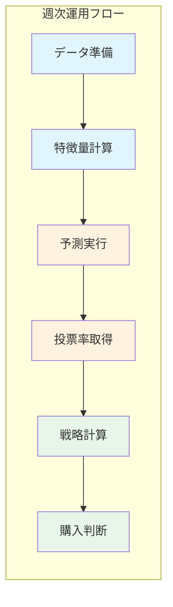
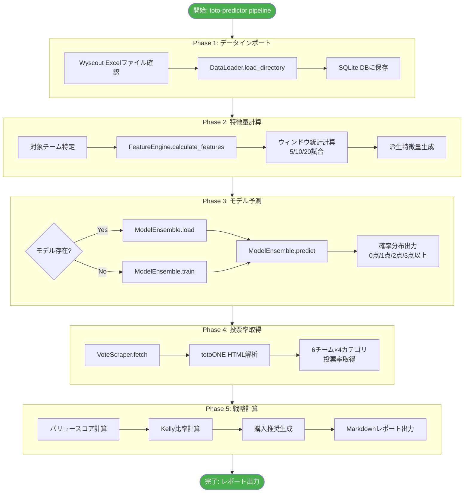
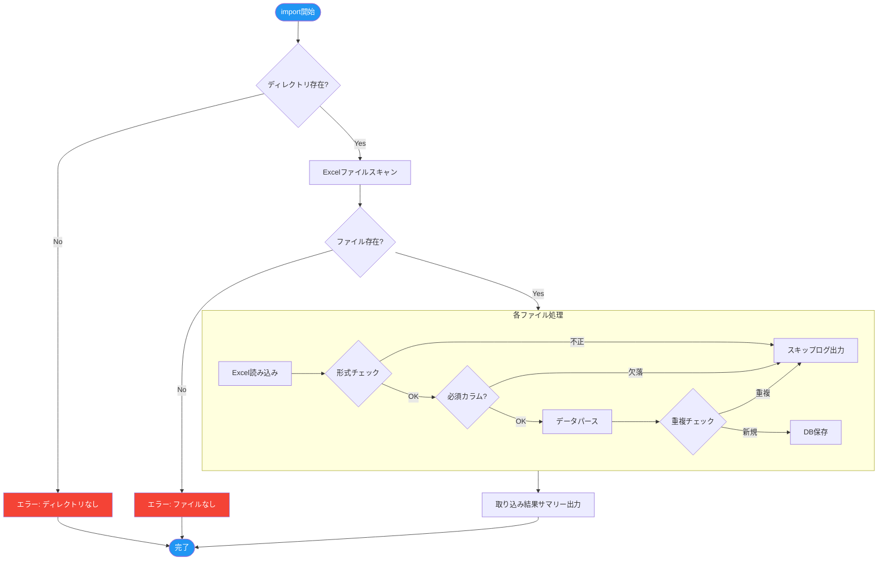
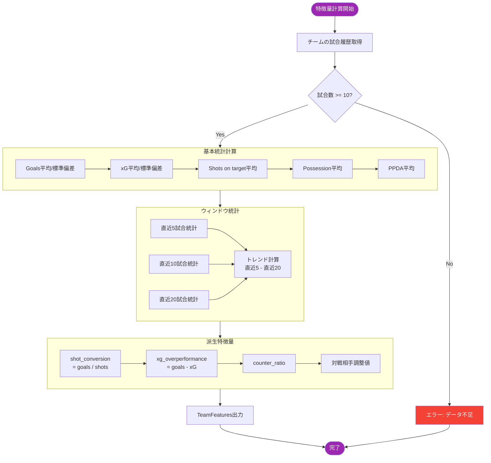
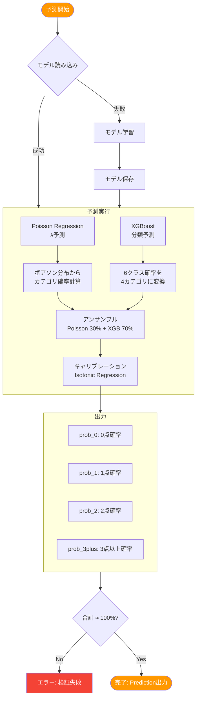
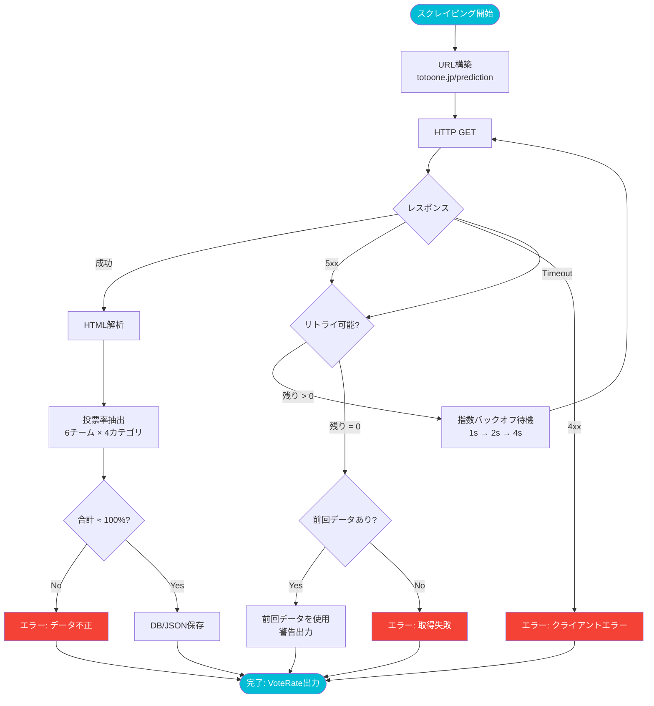
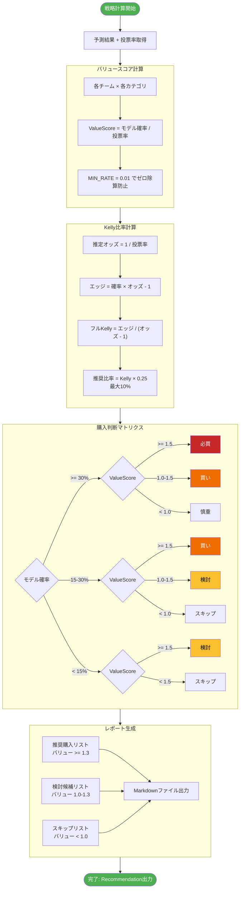
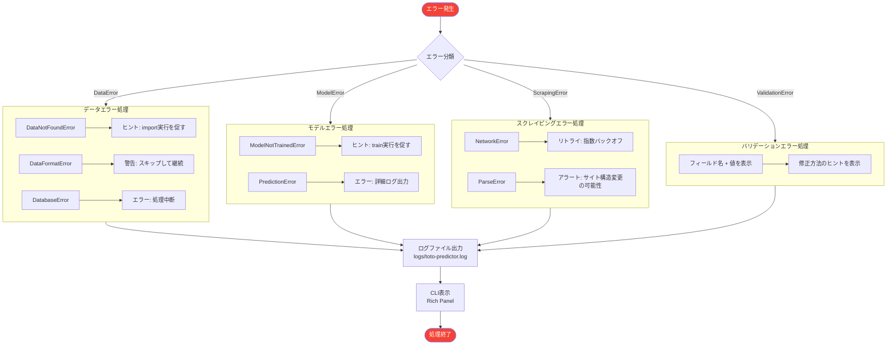
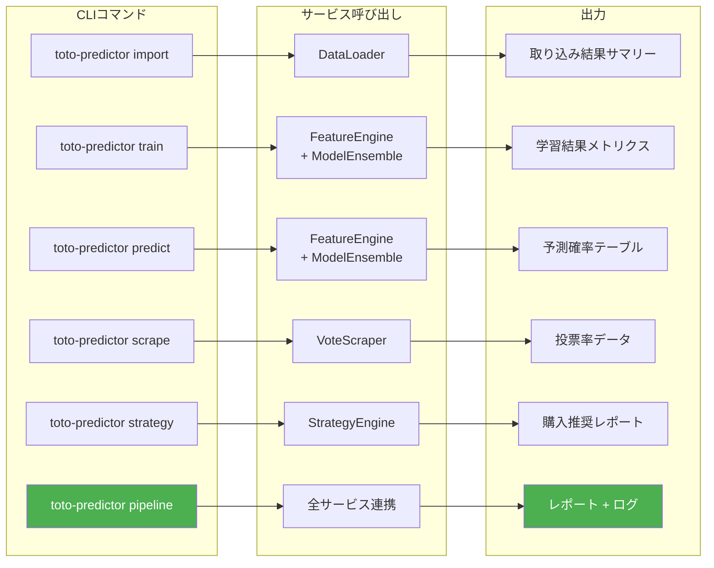
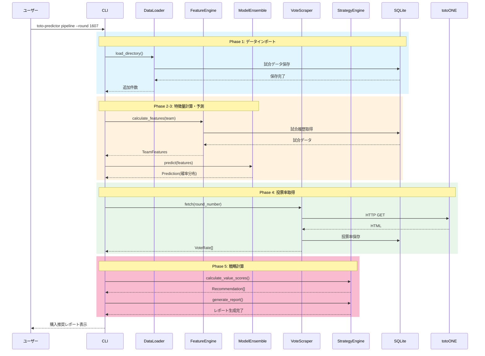

# ワークフロー図 (Workflow Diagrams)

## 全体ワークフロー概要

---

## 1. 週次パイプライン全体フロー

---

## 2. データインポートフロー

---

## 3. 特徴量計算フロー

---

## 4. モデル予測フロー

---

## 5. 投票率取得フロー

---

## 6. バリュースコア計算・購入判断フロー

---

## 7. エラーハンドリングフロー

---

## 8. CLIコマンド実行フロー

---

## 9. データの流れ（時系列）

---

## 関連ドキュメント

- [機能設計書](functional-design.md) - データモデル、コンポーネント設計
- [アーキテクチャ設計書](architecture.md) - システム構成、技術スタック
- [開発ガイドライン](development-guidelines.md) - コーディング規約、テスト方針
